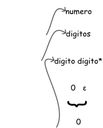
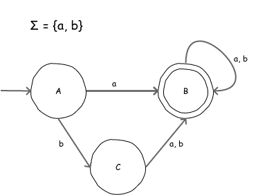
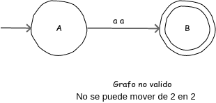

``` sh
    # Primer parcial 16 de marzo
```

## Expresión regular

1. Desarrolle una ER para todas las a's y b's que contengan exactamente 2 a's

`b*ab*ab*`

``` # cadenas de prueba:
    aba
    abbba
    aabbb
```

``` # cadenas más cortas:
    X₀ = aa
    X₁ = aba
    X₂ = baa
    X₃ = aab
```

2. Desarrolle una ER para todas las cadenas de a's y b's que contengan pares de b's

Σ = {a, b}

`(a*ba*ba*)+`

``` # cadenas más cortas:
    X₀ = bb
    X₁ = abb
    X₂ = bba
    X₃ = bab
    X₄ = abbbb     ~=  babbb
    X₅ = bbabb
    X₆ = bbbbaa    ~=  bbbab
```

## Definiciones regulares ` Pag. 123`

Es el nombre que se le da a una ER

e.g.

    `d1 -> (a|b)*`

```
X₀ -> 1
       |---------------->

X₁ = 0
```

-----

```
digito  -> 0 | 1 | … | 9
digitos -> digito digito *
signo   -> .
simbolo -> + | - | ε

numero  -> simbolo digitos signo digitos
```



```
digito      -> 0 | 1 | … | 9
digitos     -> digito digito*
signo       -> + | - | ε
decimal     -> . digitos | ε
exponente   -> E signo digitos | ε
numero      -> signo digitos decimal exponente
```

``` sh
    # traer proyecto de lenguajes
    # computadora a partir de 19:30
```

## Automatas finitos deterministas (AFD) `Pag. 130`
_Diagrama de transición/autómatas_

**Grafo** -> Conjunto de vertices (en telecomunicaciones: nodos) y aristas (en telecomunicaciones: conexiones) => `Grafo = {V,A}`

### Autómata
Es una quintupla
``` 
    Q: estados
    Σ: alfabeto
    i: estado inicial
    A: estados de aceptación
    w: función de transición
```

-----

**Graficar: grafos dirigidos**

       

#### Reglas para diagramar un AFD

* Debe cumplir con la quintupla.
* Por cada estado graficado tienen que salir la cantidad de aristas igual al número de elementos del alfabeto.
* A un estado pueden entrar _n_ aristas, al menos una.
* Todo estado isla significa que no es parte del automata.
