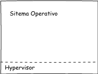

Máquina -> Sistema -> SO

### Objetivos:

    * Comodidad
    * Eficiencia
    * Capacidad evolutiva

### Servicios:

    * Creación / ejecución de programas     
    * Acceso a dispositivos                 # Domótica
    * Acceso a los archivos                 # Nube
    * Acceso al sitema                      # SO
    * Detección y manejo de errores
    * Accounting                            # Responsabilidad

### Evolución:

T | Procesos serie

I | Monitores

E | JCL                         # Lenguaje

M | Temporizador                # Evita que los procesos monopolicen recursos

P | Mono / multiprogramación

O | Tiempo compartido

  V

|   Sistema Informático |       %   |
|-----------------------|-----------|
| Pograma de aplicación|████       |
| Utilidades            |██████     |
| [SO *](#so)           |█████████  |   
| Hardware              |███████████|

#### Procesos
- Post-ejecutables
- Datos
- Contexto y ejecución

#### Gestión de memoria
- Aislamiento
- Virtualización
- Páginas

---------------------------------------------------------------------------

Nube        =>  Bigdata =>  Smart data

Domótica    =>  IOT / Machine learning

SO          =>  Interfaz a utilizar por el operador útil únicamente sobre el Hardware

##### SO
Núcleo permite comunicación hacia Hardware y utilidades

#### Virtualización

---------------------------------------------------------------------------
---------------------------------------------------------------------------

## Otras anotaciones:

## Cuestionario

1.  Indique la funcion de un monitor en un Sistema Operativo
2.  Dibuje los niveles de un Sistema Operativo virtualizado
3.  ¿Cuál es la función de un sitema de archivos?
4.  ¿A qué se refiere el servicio Accounting en un Sistema Operativo?
5.  ¿Qué es el almacenamiento secundario?
6.  ¿Qué es virtualización?

## Investigaciones cultura general

*   SAP Leonardo
*   Película IA - Steven Spielberg

## Materiales para clase

*   Máquina con mínimo 8GB de RAM para usar Hypervisor
*   Correo del ingeniero:   __mariodepaz79@gmail.com__
