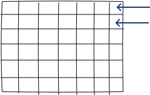
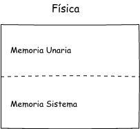
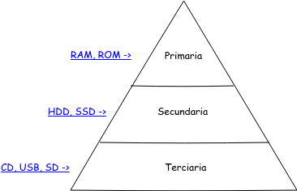
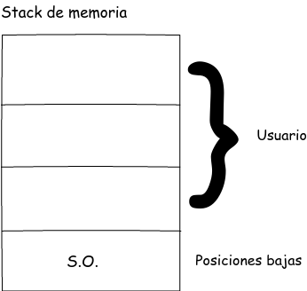

## Mecanismos de memoria virtual

Base límite -> su valor es cero

### Segmentación

### Paginación

### Segmentación paginas



### Arquitecturas en ejecución

    * CISC
    * RISC
    

`se refiere al operando, se basa en su estructura física`

#### Jhon von Neumann (Manipulación de memoria)

Amarra la memoria y asigna memoria de usuario y memeoria de sistema

#### Arquitectura Hardvard (Manipulación de memoria)

Manejan memoria reparada



`importancia de la memoria`

### Programas

Algoritmos más estructura de datos

``` sh
    # estructuras de datos:
    # Pilas, colas, listas enlazadas
```

``` sh
    # punteros:
    # se usan para reutilizar la memoria
```



### Administración de disponibilidad de memoria


### Mapa de memoria

El área de disponibilidad se vuelve mapa de memoria.



**NAS** -> Red de almacenamiento

**SAN** -> Almacenamiento de red
