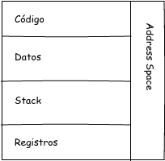
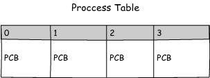
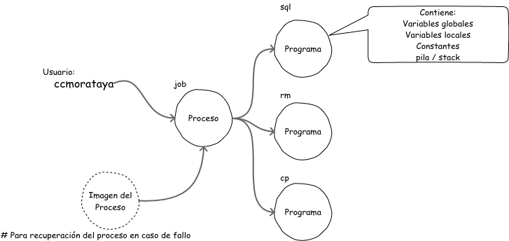
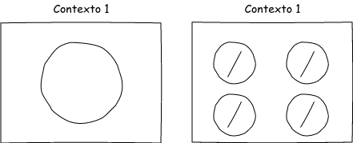
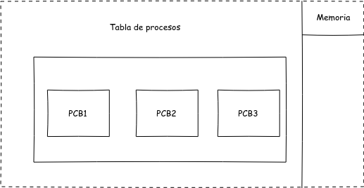
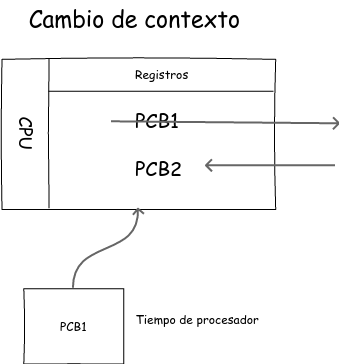

## Scheduler (Planificación de procesos)

`**PCB/BCP** -> Process Control Block -> Es un archivo de información -> Gestión de información del proceso(s) [Contiene toda la información relacionada a un proceso] -> ¿Qué hace, que se está ejecutando, cómo se está ejecutando?`



### Tabla de procesos

``` sh
    # Proceso:
    # es un programa en ejecución
```

La tabla de procesos contiene todos los PCB's



``` sh
    # UID: Id de usuario
    # GID: Id de grupo
```

### Ubicación de procesos

UID -> 0 -> root



#### Sistema Operativo (SO)

Gestiona la tabla de procesos que contienen los PCB's/BCP's

### Creación de proceso

Colocar un proceso en memoria

```
Calendarización -> Calendarizador -> Control de tiempo
                    ↳ Cuando hayan recursos disponibles para cargar un proceso
```

Los procesos pueden ser o no concurrentes (simultaneos), esto es gestionado por el SO.

**Puntero** => referencia a un espacio de memoria

``` sh
    # temporizador y monitor usuados para gestión del tiempo de procesador
```

``` sh
    # Planificación:
    # Asignación eficiente de los recursos
```

### Destrucción de proceso

Cuando se completa la ejecución:

*   Finalización Normal [Voluntario]
*   Finalización con error voluntario [Voluntario]
*   Error Fatal [Involuntario]          `P.ej. un número dividido cero`
*   Terminación Forzada [Involuntario]  `P.ej. Un proceso con mayor autoridad cierra el proceso actual`

### Estados de un proceso

*   New
*   Running
*   Waiting
*   Ready
*   Terminated

``` sh
    # Esquema ejemplo de los estados de un proceso
    * Proceso nuevo, en memoria, PCB pero aun no admitido   [NEW]
    🡓
    * Espera tiempo de procesador                           [READY]
    🡓
    * Scheduler asigna nuevos recursos después de aceptado  [RUNNING]
    🡓
    * Espera I/O o un recurso                               [WAITING] luego [READY]
    🡓
    * Si espera por tiempo se interrumpe el proceso         [READY]
    |   ↳ Espera a que se cumpla el tiempo y continua       [RUNNING]
    🡓
    * Al finalizar                                          [TERMINATED]
```

### Procesos suspendidos (swap)

Estado adicional solo en sistemas que implementan **swap**

### Cambio de contexto

Estructurada para gestionar PCB => Contexto







Cambio de contexto es cambiar los valores de los registros de la CPU de los valores de un proceso a los valores de otro proceso

El cambio de contexto también requiere tiempo de procesador, espacio de tiempo muerto en el que no se puede asignar o despachar un PCB [Overhead]

**Quantum** o **Quanto** es una unidad de tiempo X, que será el tiempo de procesador que se puede asignar a un proceso o cola de procesos.
